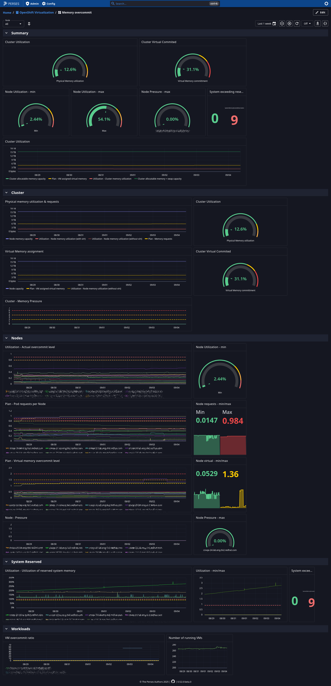

## Deploy the dashboards

> [!IMPORTANT]
> You need to have permissions to read metric from prometheus in
> OpenShift.

> [!IMPORTANT]
> Make sure to be logged into OpenShift at this point.
> `oc whoami -t` will be used in order to get the url to prometheus.

1. Install `percli`
2. Launch perses

    $ podman run --rm -p 127.0.0.1:8080:8080 docker.io/persesdev/perses

3. Build an deploy project, datasource, secret, and dashboards

> [!NOTE]
> You need to have `make` installed

    $ cd memory
    $ make apply
    ...
    object "Dashboard" "memory" has been applied in the project "openshift-cnv"
    $

4. Navigate to perses to enjoy the dashboard

    $ make url
    http://localhost:8080/projects/openshift-cnv/dashboards/memory
    $

5. Optional: Generate some load

    $ oc apply -f manifests/memory-load.yaml
    $ oc edit vmpool memory-load

## Look

